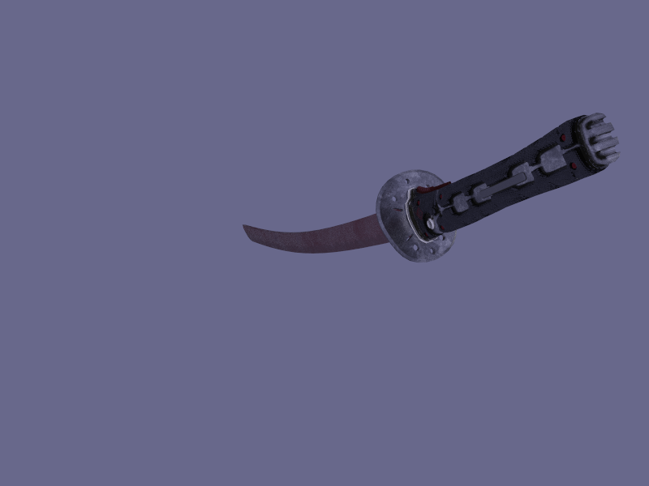
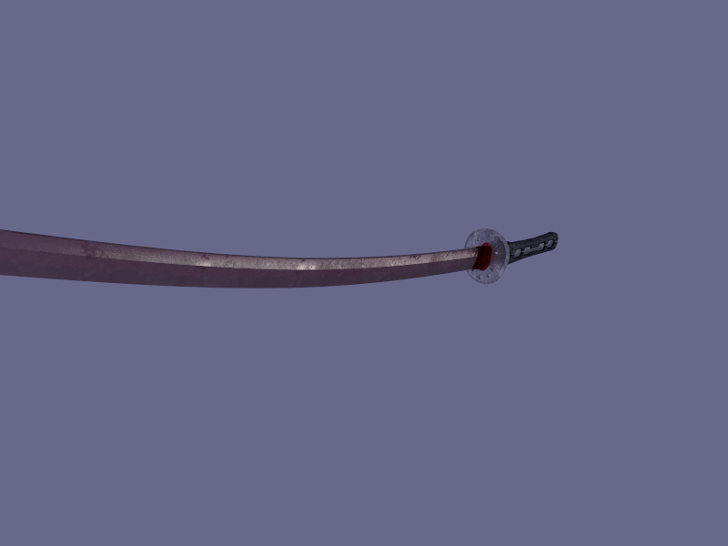

# CUDA Raytracer Project
This project is a C++/CUDA application for loading a 3D model and rendering it using a path tracing algorithm. The application allows for basic manipulation of the camera and positioning of the loaded objects. 

## Example Renders

## Building the Project

1. Download visual studio 2022
2. Clone the project
3. [Download](https://www.glfw.org/download) and link the the GLFW library.
4. [Download](https://github.com/assimp/assimp) and link the library.
5. Open the project in visual studio using the .sln file.
