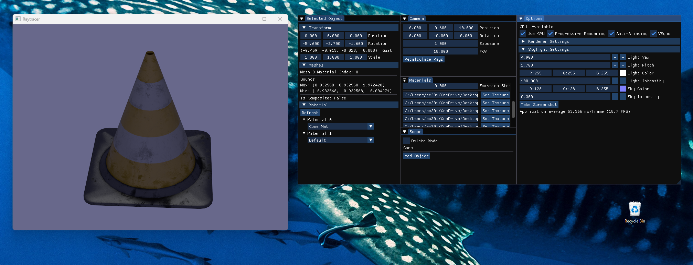
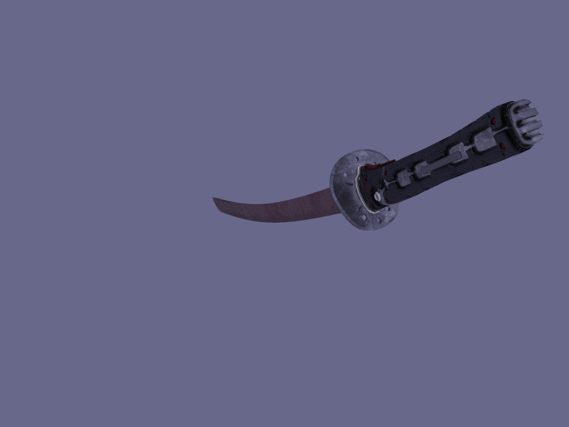
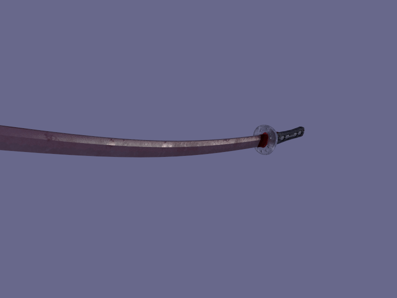
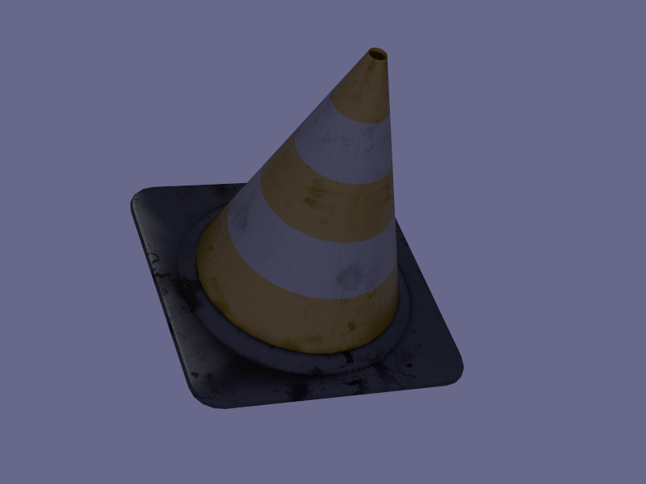

# CUDA Raytracer Project

A C++/CUDA path tracer with an OpenGL display front-end, built to demonstrate core computer graphics concepts. The app loads 3D models (via Assimp), renders them with a physically based path tracer on either the CPU or GPU, and allows interactive camera control, object placement, and material editing through a real-time GUI.



## Example Renders

<p align="center">
  
  
  
</p>

---

## Architecture Overview

- **Host (C++)**: GLFW window, ImGui UI, scene graph, camera, and model loading. The host builds scene and camera data and either invokes the **CPU raytracer** or the **CUDA raytracer**, then displays the result.
- **Display**: A fullscreen quad is drawn in OpenGL; when using the GPU, the raytracer writes directly into an OpenGL texture via **CUDA–OpenGL interop** (`cudaGraphicsGLRegisterImage` / surface objects), so no CPU readback is needed for display.
- **Dual backends**: The same scene, camera, and renderer settings (bounces, samples, AO, skylight, etc.) drive both a single-threaded CPU path tracer and a CUDA kernel. You can switch between them at runtime from the Options window (e.g. for debugging or when no CUDA device is available).

---

## Graphics Concepts Implemented

### Path tracing and sampling

- **Path tracing** with configurable bounce count and max ray distance.
- **Per-pixel multi-sampling** with optional jitter (anti-aliasing); samples are accumulated and averaged.
- **Progressive refinement**: in GPU mode, frames can be accumulated over time (running average with previous frame) for cleaner convergence.
- **Cosine-weighted hemisphere sampling** for diffuse and a roughness-based blend toward specular for the next path direction.
- **HDR exposure**: result is tone-mapped with `1 - exp(-color * exposure)` before display.

### PBR (Cook–Torrance BRDF)

- **Cook–Torrance** microfacet model:
  - **GGX** (Trowbridge–Reitz) normal distribution.
  - **Smith** geometry term (Schlick-GGX for visibility).
  - **Schlick** approximation for Fresnel; F0 blended by metalness.
- **Metalness/roughness workflow**: albedo, roughness, and metalness (with optional texture maps) drive the BRDF; emission is supported for first-hit and along the path.

### Ray–geometry

- **Ray–AABB**: ray vs axis-aligned box in object space (inverse model matrix used to transform ray into model space). Used as an early reject per object before ray–triangle tests.
- **Ray–triangle**: robust ray–triangle intersection with barycentric coordinates. Implementation uses axis permutation (largest component of the ray direction) for numerical stability and double precision for edge tests when needed (Möller–Trumbore–style).
- **Per-object composite bounds**: each `DisplayObject` has a composite AABB over all its meshes for a single cheap reject before iterating meshes/triangles.

### Materials and shading

- **TBN from UVs**: tangent and bitangent are derived from the triangle’s UV deltas; the normal is either interpolated from vertex normals or from the triangle. **Gram–Schmidt** is used to orthogonalize the tangent to the normal, then the bitangent is recomputed so the TBN matrix correctly transforms normal-map vectors to world space.
- **Texture mapping**: albedo, normal, roughness, metalness, ambient occlusion, and emission can be driven by textures. On the GPU, materials and textures are mirrored to device memory (CUDA texture objects for sampling); the host `Material` class pushes updates via `sendToGPU()`.

### Lighting and environment

- **Directional “sun”**: single directional light with configurable direction (yaw/pitch) and color/intensity, combined with a simple sky color and intensity.
- **Ambient occlusion**: AO term (from material or default) is applied on the first hit only, scaled by a global AO intensity.

---

## Project Structure (high level)

| Area                         | Role                                                                                                                                                                                                                                                                       |
| ---------------------------- | -------------------------------------------------------------------------------------------------------------------------------------------------------------------------------------------------------------------------------------------------------------------------- |
| `main.cpp`                   | Creates `RenderWindow` and runs the render loop.                                                                                                                                                                                                                           |
| `RenderWindow`               | GLFW/OpenGL/ImGui setup, CUDA–GL interop, CPU/GPU toggle, camera/scene/material GUI, screenshot (lodepng).                                                                                                                                                                 |
| `Scene`                      | Scene graph (`DisplayObject` map); builds `GPUObjectDataVector` (model matrices, inverse, and pointers to GPU mesh/material data) for the CUDA raytracer each frame.                                                                                                       |
| `Camera`                     | Position, quaternion rotation, FOV, exposure. Precomputes primary ray directions (and uploads them as a CUDA texture when using GPU).                                                                                                                                      |
| `DisplayObject`              | Transform (position/rotation/scale), composite AABB, list of meshes + material indices. Packs mesh and material pointers into `LLGPUObjectData` and uploads to GPU.                                                                                                        |
| `CustomModel`                | Loads models via Assimp (triangulate, UVs, flip UVs); extracts materials and textures (albedo, normal, roughness, metalness, AO, emission); builds meshes and sends them to the GPU.                                                                                       |
| `Material` / `GPUMaterial`   | Host material with optional textures; `GPUMaterial` is the device-side mirror with CUDA texture objects. Same interface for albedo, normal, roughness, metal, AO, emission.                                                                                                |
| `processor/GPU/GPURaytracer` | CUDA kernel: one thread per pixel (with a small 3D block for multiple samples per pixel). Ray setup from camera texture, path loop, ray–AABB then ray–triangle, material evaluation, Cook–Torrance next direction, exposure, optional progressive blend, write to surface. |
| `processor/CPU/CPURaytracer` | Single-threaded path tracer over the same scene/camera/settings; fills a float buffer that is then uploaded to the OpenGL texture.                                                                                                                                         |
| `linal.hpp`                  | Device-side `mat3`/`mat4` (column vectors) and transfer macros from GLM for use in CUDA code.                                                                                                                                                                              |

The GPU kernel uses **8×8×4** thread blocks: each (x,y) pixel can run up to 4 sample iterations in the z dimension; partial colors are reduced in shared memory and the final average is written by the thread with `threadIdx.z == 0`.

---

## Tech Stack

- **C++** (host), **CUDA** (device kernels and memory)
- **OpenGL 3.3** (Core), **GLFW**, **GLAD**
- **Dear ImGui** (docking, viewports)
- **CUDA–OpenGL interop** (render target is a registered GL texture)
- **GLM** (host math: vectors, matrices, quaternions)
- **Assimp** (model loading: meshes, materials, textures)
- **stb_image** (image loading for textures)
- **lodepng** (screenshot encoding)

---

## Building the Project

This project targets **Windows x64** and is built with **Visual Studio 2022**, **CUDA 12.3**, and **C++17**. GLFW, GLM, and Assimp headers are vendored under `include/`; prebuilt static libraries must be placed in `lib/`.

### Prerequisites

| Requirement                    | Notes                                                                                                                                                                    |
| ------------------------------ | ------------------------------------------------------------------------------------------------------------------------------------------------------------------------ |
| **Visual Studio 2022**         | Workload: _Desktop development with C++_. Include the **MSVC v143** toolset and **Windows 10/11 SDK**.                                                                   |
| **CUDA Toolkit 12.3**          | Must match the version referenced in `Raytracer.vcxproj` (`CUDA 12.3.props` / `CUDA 12.3.targets`). [Download from NVIDIA](https://developer.nvidia.com/cuda-downloads). |
| **NVIDIA GPU**                 | Required for GPU raytracing and CUDA–OpenGL interop.                                                                                                                     |
| **Static libraries in `lib/`** | `glfw3.lib`, `assimp-vc143-mt.lib`, `zlibstatic.lib` (Release, x64, `/MD` runtime).                                                                                      |

Assimp is **not** fully vendored — you must build or obtain the `.lib` files yourself (see [Building external libraries](#building-external-libraries) below).

### MSVC and CUDA version compatibility

CUDA 12.3 officially supports MSVC toolsets up through early VS 2022 releases. If Visual Studio has been updated recently, you may hit:

```
#error: -- unsupported Microsoft Visual Studio version!
```

**Pick one approach and use the same MSVC version for the whole project and all prebuilt libs:**

1. **Pin MSVC 14.39 (recommended for CUDA 12.3)**
   - Visual Studio Installer → **Individual components** → install **MSVC v143 - VS 2022 C++ x64/x86 build tools (v14.39-17.9)**.
   - Project Properties → **General** → **Platform Toolset** → select the **14.39** variant.
   - Rebuild Assimp (and any other prebuilt libs) with the same toolset.

2. **Upgrade CUDA to 12.6+**
   - Supports newer MSVC (e.g. 14.44). Update the CUDA version in `Raytracer.vcxproj` and rebuild.

3. **Override the version check (not recommended)**
   - Add `-allow-unsupported-compiler` to **CUDA C/C++ → Command Line → Additional Options** in the project properties.

### Building external libraries

Prebuilt Assimp binaries from a different VS update will fail at link time with unresolved `__std_*` symbols (e.g. `__std_search_1`, `__std_find_last_of_trivial_pos_1`). **Assimp must be compiled with the same MSVC minor version as this project.**

Build Assimp with CMake (from **cmd.exe**, not PowerShell, if you use `vcvarsall`):

```bat
git clone https://github.com/assimp/assimp.git
cd assimp
mkdir build && cd build
cmake .. -G "Visual Studio 17 2022" -A x64 -T version=14.39
cmake --build . --config Release
```

If `14.39` is not recognized, use the full folder version from `C:\Program Files\Microsoft Visual Studio\2022\<Edition>\VC\Tools\MSVC\` (e.g. `14.39.33519`):

```bat
cmake .. -G "Visual Studio 17 2022" -A x64 -T version=14.39.33519
```

Copy the Release output (`assimp-vc143-mt.lib` or equivalent) into `lib/`. Build **GLFW** and **zlib** the same way if you do not already have matching `.lib` files.

To verify the compiler before building dependencies:

```bat
"C:\Program Files\Microsoft Visual Studio\2022\Professional\VC\Auxiliary\Build\vcvarsall.bat" x64 -vcvars_ver=14.39
cl
```

The banner should report **Compiler Version 19.39.x**, not 19.44.x.

### Build steps

1. Clone the repository.
2. Place `glfw3.lib`, `assimp-vc143-mt.lib`, and `zlibstatic.lib` in `lib/`.
3. Open `Raytracer.sln` in Visual Studio 2022.
4. Set configuration to **Release | x64** (Debug \| x64 also works; Win32 is not configured for CUDA dependencies).
5. Build → **Build Solution** (`Ctrl+Shift+B`).

The executable is written to `x64\Release\Raytracer.exe`.

### Troubleshooting

#### `cudafe++.exe` blocked by Device Guard (exit code 199)

If the build log shows:

```
'...\CUDA\v12.3\bin\cudafe++.exe' was blocked by your organization's Device Guard policy.
```

Windows **WDAC / Device Guard** is blocking a CUDA compiler component. This is a system security policy, not a project bug.

- On a **personal PC**: check **Settings → Privacy & security → Windows Security → App & browser control → Smart App Control** and disable it if enabled; review Code Integrity event logs (`Microsoft-Windows-CodeIntegrity/Operational`, event IDs 3076/3077).
- On a **managed/work PC**: contact IT to allowlist the NVIDIA CUDA Toolkit install directory.

Disabling **Memory integrity** alone may not be enough if a separate WDAC policy is active.

#### Assimp linker errors (`__std_*` unresolved externals)

The Assimp `.lib` was built with a newer MSVC than your project. Rebuild Assimp with the same toolset version you use for Raytracer (see [Building external libraries](#building-external-libraries)).

#### Duplicate object warnings (`LNK4042`)

If you see warnings about `CustomModel.obj` or `CPURaytracer.obj` being specified more than once, ensure header files (`.hpp`) are listed as **Include** items in the project, not **Compile** items — only `.cpp` and `.cu` files should be compiled.

### Runtime notes

- **GPU availability**: If no CUDA device is found (or CUDA–OpenGL interop fails), the Options window shows **GPU: Not Available** and the CPU raytracer is used. Toggle **Use GPU** when a device is available.
- **Shader paths**: `RenderWindow.cpp` contains hardcoded absolute paths to the GLSL shader files. Update them to your local clone path before running, or the display pipeline will fail to initialize.
- **Model import paths**: When adding a custom model from the Scene UI, use **forward slashes** in the path (e.g. `C:/Users/you/Desktop/model.obj`). Backslash-only Windows paths can cause crashes during material/texture path resolution.
- **Working directory**: Run the executable from the project root or ensure relative asset paths resolve correctly.
